---
## Front matter
title: "ОТЧЕТ ПО ЛАБОРАТОРНОЙ РАБОТЕ No 2"
subtitle: "Архитектура вычислительных систем"
author: "Чулкова Валерия Алексеевна"

## Generic otions
lang: ru-RU
toc-title: "Содержание"

## Bibliography
bibliography: bib/cite.bib
csl: pandoc/csl/gost-r-7-0-5-2008-numeric.csl

## Pdf output format
toc: true # Table of contents
toc-depth: 2
lof: true # List of figures
lot: true # List of tables
fontsize: 12pt
linestretch: 1.5
papersize: a4
documentclass: scrreprt
## I18n polyglossia
polyglossia-lang:
  name: russian
  options:
	- spelling=modern
	- babelshorthands=true
polyglossia-otherlangs:
  name: english
## I18n babel
babel-lang: russian
babel-otherlangs: english
## Fonts
mainfont: PT Serif
romanfont: PT Serif
sansfont: PT Sans
monofont: PT Mono
mainfontoptions: Ligatures=TeX
romanfontoptions: Ligatures=TeX
sansfontoptions: Ligatures=TeX,Scale=MatchLowercase
monofontoptions: Scale=MatchLowercase,Scale=0.9
## Biblatex
biblatex: true
biblio-style: "gost-numeric"
biblatexoptions:
  - parentracker=true
  - backend=biber
  - hyperref=auto
  - language=auto
  - autolang=other*
  - citestyle=gost-numeric
## Pandoc-crossref LaTeX customization
figureTitle: "Рис."
tableTitle: "Таблица"
listingTitle: "Листинг"
lofTitle: "Список иллюстраций"
lotTitle: "Список таблиц"
lolTitle: "Листинги"
## Misc options
indent: true
header-includes:
  - \usepackage{indentfirst}
  - \usepackage{float} # keep figures where there are in the text
  - \floatplacement{figure}{H} # keep figures where there are in the text
---

# Цель работы

Изучение идеологии системы контроля версий git и их применение.
Приобретение практических навыков по работе с системой git: создание учётной записи, SSH ключа, рабочего пространства и репозитория курса на основе шаблона и настройка каталога.

Цель данного шаблона --- максимально упростить подготовку отчётов по
лабораторным работам.  Модифицируя данный шаблон, студенты смогут без
труда подготовить отчёт по лабораторным работам, а также познакомиться
с основными возможностями разметки Markdown.

# Задание

1. Создайте отчет по выполнению лабораторной работы в соответствующем
каталоге рабочего пространства (labs>lab03>report).
2. Скопируйте отчеты по выполнению предыдущих лабораторных работ в
соответствующие каталоги созданного рабочего пространства.
3. Загрузите файлы на github.

# Теоретическое введение

Здесь описываются теоретические аспекты, связанные с выполнением работы.

Например, в табл. [-@tbl:std-dir] приведено краткое описание стандартных каталогов Unix.

: Описание некоторых каталогов файловой системы GNU Linux {#tbl:std-dir}

| Имя каталога | Описание каталога                                                                                                          |
|--------------|----------------------------------------------------------------------------------------------------------------------------|
| `/`          | Корневая директория, содержащая всю файловую                                                                               |
| `/bin `      | Основные системные утилиты, необходимые как в однопользовательском режиме, так и при обычной работе всем пользователям     |
| `/etc`       | Общесистемные конфигурационные файлы и файлы конфигурации установленных программ                                           |
| `/home`      | Содержит домашние директории пользователей, которые, в свою очередь, содержат персональные настройки и данные пользователя |
| `/media`     | Точки монтирования для сменных носителей                                                                                   |
| `/root`      | Домашняя директория пользователя  `root`                                                                                   |
| `/tmp`       | Временные файлы                                                                                                            |
| `/usr`       | Вторичная иерархия для данных пользователя                                                                                 |

Более подробно об Unix см. в [@gnu-doc:bash;@newham:2005:bash;@zarrelli:2017:bash;@robbins:2013:bash;@tannenbaum:arch-pc:ru;@tannenbaum:modern-os:ru].

# Выполнение лабораторной работы

1. Для выполнения работы используем https://github.com/ и создаём учётную
запись, заполняя основные данные.

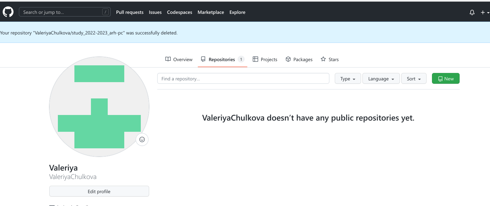{ #fig:001 width=95% }

2. Сначала сделаем предварительную конфигурацию git (совокупность
настроек программы, задаваемая пользователем, а также процесс изменения
этих настроек в соответствии с нуждами пользователя).
Открываем терминал и вводим следующие команды, указав своё имя и email.
Настроим utf-8 в выводе сообщений git (чтобы русские символы были
читаемы, необходимо изменить параметр quotepath в секции [core], установив
его в false).
Параметр autocrlf (форматирование и пробелы) : существует проблема
переноса строк т. к. Windows при создании файлов использует для
обозначения переноса строки два символа «возврат каретки» и «перевод
строки», а Linux лишь «перевод строки», поэтому используем значение input,
чтобы устранить этот факт.
Параметр safecrlf (проверит, что можно откатить изменения (из LF в
CRLF)и предупредит о том, что может случиться что-то нехорошее).

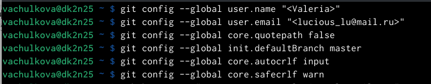{ #fig:002 width=95% }

3. Для последующей идентификации пользователя на сервере репозиториев
сгенерируем пару ключей (приватный и открытый): с помощью команды
ssh-keygen -C "Имя Фамилия <work@mail>"

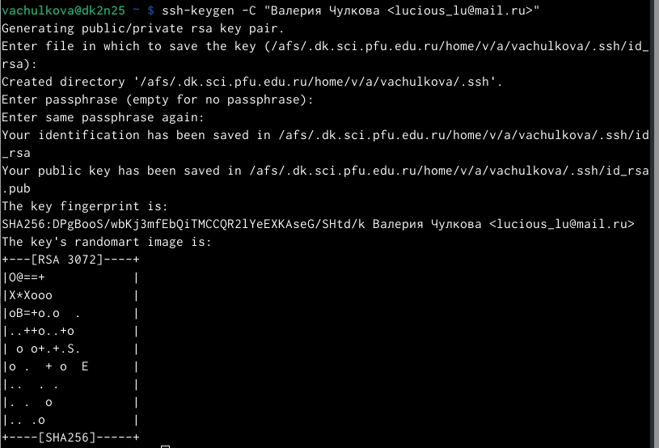{ #fig:003 width=95% }

4. Далее загрузим сгенерированный открытый ключ, зайдя на сайт
http://github.org/ под своей учётной записью и перейдём в меню Setting. Псоле
этого выберем в боковом меню SSH and GPG keys и нажмём кнопку New SSH
key. Скопировав из локальной консоли ключ в буфер обмена
cat ~/.ssh/id_rsa.pub | xclip -sel clip , вставим ключ в появившееся на сайте поле
и указываем для ключа имя.

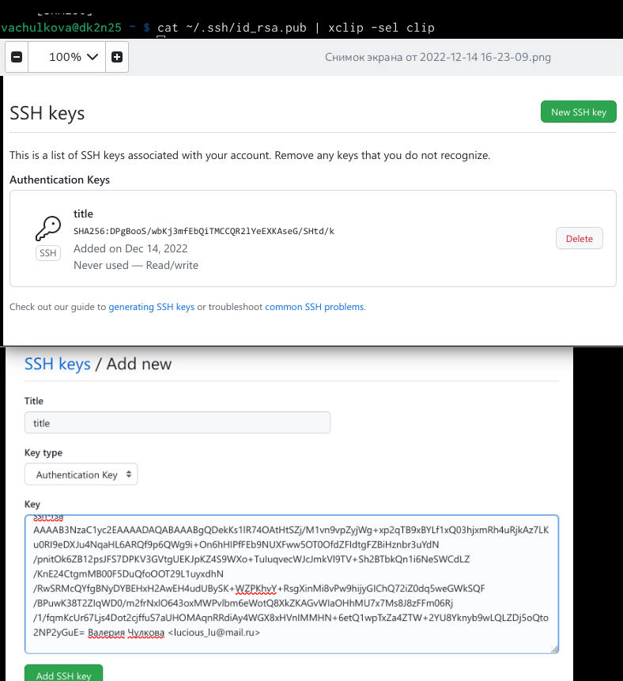{ #fig:004 width=95% }

6. Откроем терминал и создадим каталог для предмета «Архитектура
компьютера».

{ #fig:006 width=95% }

7. Репозиторий на основе шаблона можно создать через web-интерфейс github.
Перейдём на станицу репозитория с шаблоном курса
https://github.com/yamadharma/course-directory-student-template. Далее
выберем Use this template.
В открывшемся окне задаём имя репозитория study_2022–2023_arh-pc и
создаём репозиторий (кнопка Create repository from template).

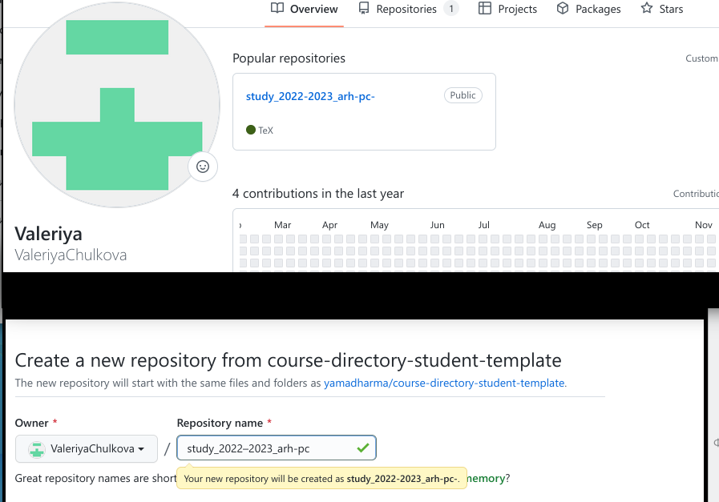{ #fig:007 width=95% }

8. Откроем терминал и перейдём в каталог курса и клонируем созданный репозиторий.

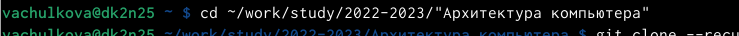{ #fig:008 width=95% }

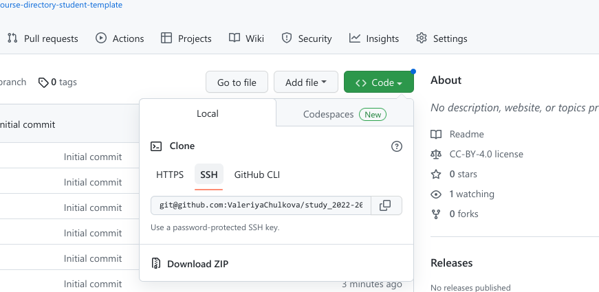{ #fig:009 width=95% }

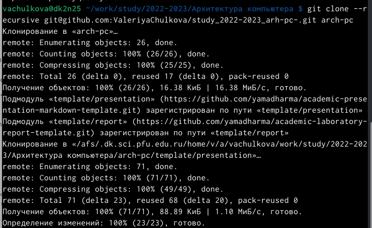{ #fig:010 width=95% }

9.  Удаляю лишние файлы и создаю необходимые каталоги.

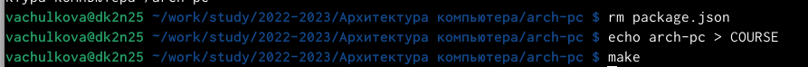{ #fig:011 width=95% }

10. Отправляю файлы на сервер. 

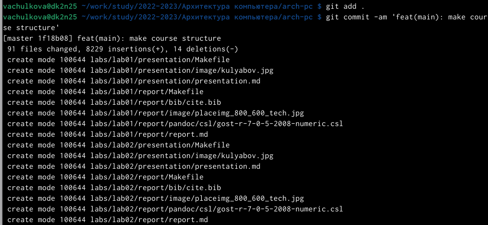{ #fig:012 width=95% }

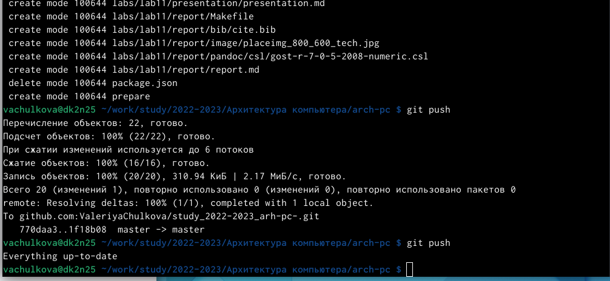{ #fig:013 width=95% }

# Выполнение самостоятельной работы

Загружаю отчет по лабораторной работе 1 в гитхаб.

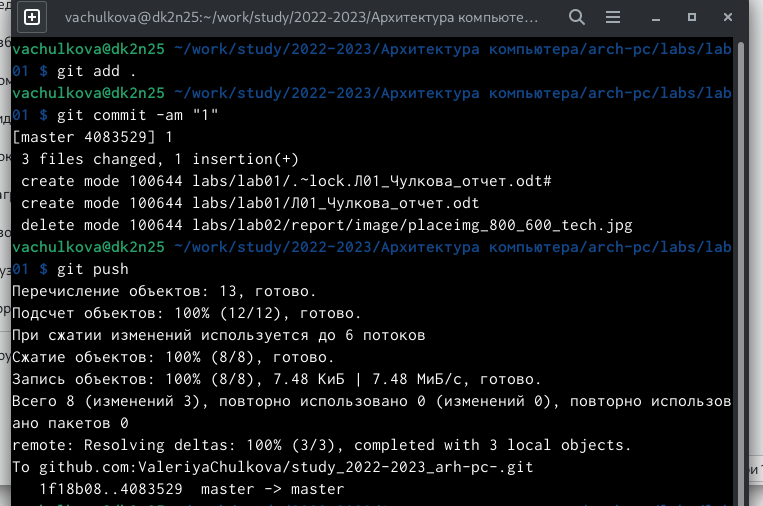{ #fig:014 width=95% }

# Выводы

В ходе работы мы изучили идеологии системы контроля версий git и их применение. Приобрели практические навыки по работе с системой git: создание учётной записи, SSH ключа, рабочего пространства и репозитория курса на основе шаблона и настройка каталога.

# Список литературы{.unnumbered}

::: {#refs}
:::
